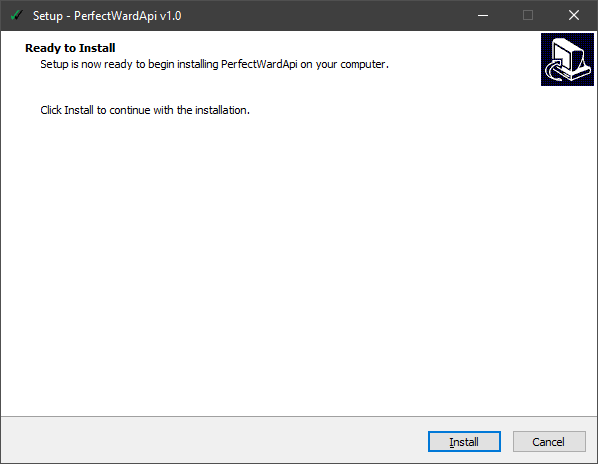
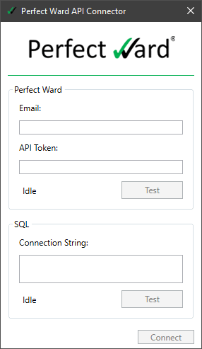

# Connector

## Summary {docsify-ignore}

* For a simplified approach to getting data stored, the API Connector is provided to streamline the process of fetching and storing reports in a database.

## Requirements {docsify-ignore}

* A Perfect Ward email and [API token](developer_quickstart.md?id=generate-api-token).
* A Microsoft SQL Server Instance and Connection String
* The latest Perfect Ward API Connector [Release](https://github.com/todo/todo/releases)

## Installation {docsify-ignore}

* After downloading the latest Connector release, run the file and proceed through the installation process.

* After completing the installation, a new window will appear requesting the Perfect Ward API credentials and MSSQL connection string.

* Enter the information for both sections and click `Test` for each.
* If you receive a green success message for both sections, proceed to click the final `Connect` button.
* If either test returns a red error message, please confirm the validity of your credentials and connection string. Ensuring that the API token is up to date and that the MSSQL server is reachable.
* After clicking connect, the settings are saved to the current user account, and the connector is scheduled to run every 24 hours. The connector is then run in the background to begin pulling in details.

## Connector {docsify-ignore}

* The connector works as follows:
  * Query the database for the latest report, if any.
  * Query the Perfect Ward API for all report IDs newer than the last stored report.
  * For each report ID available, query the Perfect Ward API for a detailed report.
  * Store the report information into the `reports` table.
  * For each Answer in the report, save into the `answers` table.
  * Details on how the data is stored is available [here](db_details.md?id=database-details).